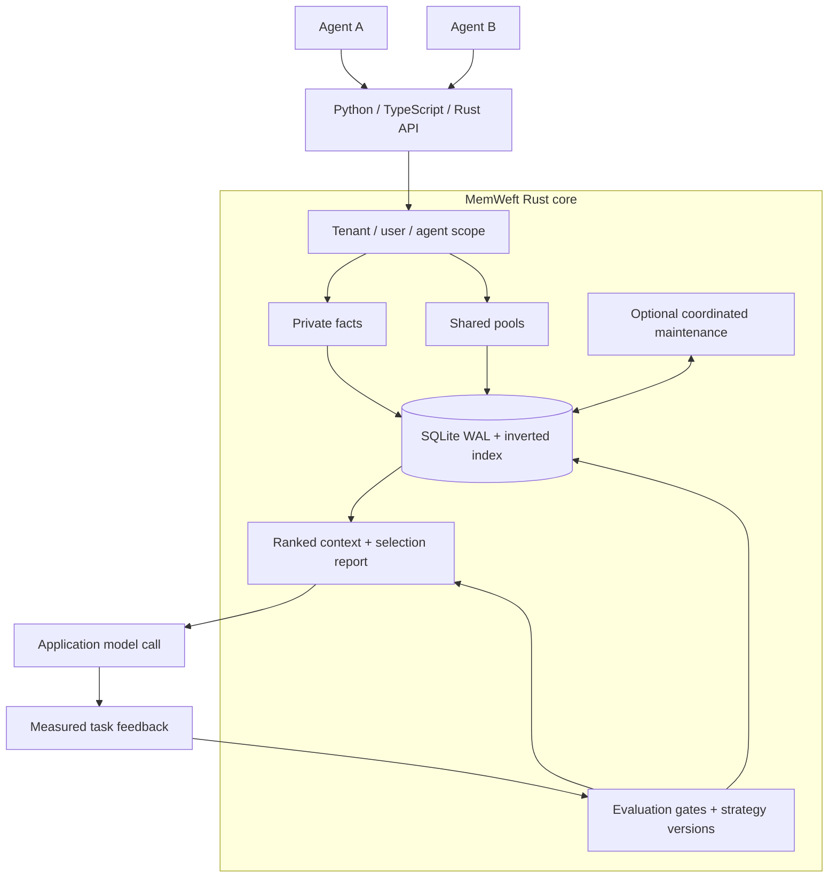
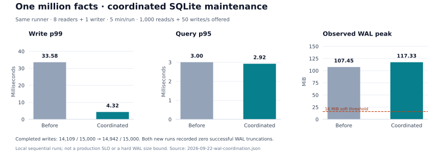
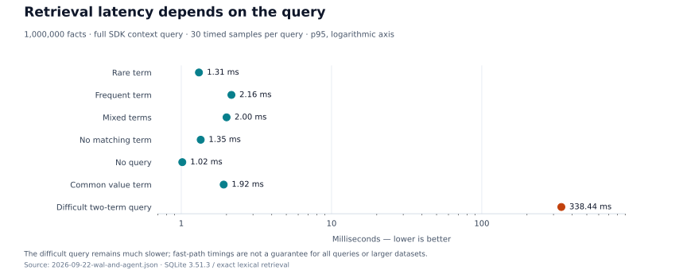

<div align="center">

# MemWeft

**Persistent memory. Shared knowledge. Evaluated learning.**

A Rust memory engine for agents, with Python and TypeScript SDKs.

[](https://github.com/chongliujia/memweft/actions/workflows/verify.yml)
[](LICENSE)
[](Cargo.toml)
[](python/README.md)
[](typescript/README.md)

[Quickstart](#quickstart) · [Architecture](#architecture) · [Performance](#performance) · [Agent evaluations](#agent-evaluations) · [Guides](#guides) · [Contributing](#contributing)

</div>

MemWeft gives agents persistent facts, resumable conversations and relevant model context. Keep one agent's memory private, share selected facts across agents, and adopt learned strategies only after evaluation.

**Local-first:** memory operations need no model service or API key. The high-level APIs use SQLite; optional PostgreSQL/MySQL support is currently limited to the older low-level API.

## What you can build

| Need | Available today |
|---|---|
| An agent that remembers | Persistent facts, updates, forgetting and idempotent session messages |
| A team of agents | Private/shared/mixed pools, read/write permissions, precedence and revision checks |
| Relevant context at scale | Indexed lexical retrieval, bounded candidate loading and selection explanations |
| Measurable improvement | Feedback, evaluation gates, strategy versioning, source invalidation and rollback |
| Framework integration | Python LangGraph and LangGraph.js context helpers and `BaseStore` adapters |
| Controlled model inputs | Optional Python reference projection and audited sandbox execution examples |
| Observable local storage | Optional background checkpointing, coordinated maintenance, takeover and diagnostics |

Enterprise deployment is the target. Distributed sharding, hot-data preloading, RDMA, automatic conversation extraction and a full query/loading/compression pipeline remain future work.

## Quickstart

Build from source with **Rust 1.89+**, a C toolchain and Python 3.10–3.12:

```bash
python -m venv .venv
source .venv/bin/activate
python -m pip install maturin
cd python
maturin develop
cd ..
```

On Windows, activate with `.venv\Scripts\activate`. Registry publishing and automatic platform package selection remain future work.

```python
from memweft import Memory

with Memory("./memory.db") as memory:
    alice = memory.user("alice", tenant_id="my-app", agent_id="assistant")
    alice.remember("Prefers concise answers", key="reply_style")

    chat = alice.session("chat-001")
    chat.add_message("user", "Explain Rust ownership", event_id="question-1")
    context = chat.context(query="reply style", max_tokens=1000)
    print(context.text)
    print(context.explain())
```

Run it twice: the preference updates by key, and the event ID prevents duplicate messages. `memories()` inspects facts, `forget(key)` removes them, and `chat.clear()` clears session messages. Python also provides `AsyncMemory`.

<details>
<summary><b>TypeScript / Node.js</b></summary>

From the repository root:

```bash
cd typescript
npm ci
npm run build:native
npm run build
npm test
cd ..
```

```typescript
import { Memory } from "memweft";

const memory = await Memory.open({ path: "./memory.db" });
try {
  const alice = memory.user("alice", { tenantId: "my-app", agentId: "assistant" });
  await alice.remember("Prefers concise answers", { key: "reply_style" });
  const chat = alice.session("chat-001");
  await chat.addMessage("user", "Explain Rust ownership", { eventId: "question-1" });
  console.log((await chat.context({ query: "reply style", maxTokens: 1000 })).text);
} finally {
  memory.close();
}
```

The native addon targets Node.js 20+. Browser/Edge access and an HTTP service remain future work. See the [TypeScript guide](typescript/README.md).

</details>

<details>
<summary><b>Rust / CLI</b></summary>

```bash
cargo run --locked -p memweft -- remember alice reply_style "Prefers concise answers"
cargo run --locked -p memweft -- context alice chat-001
cargo run --locked -p memweft -- memories alice
```

Put `--db PATH` before the subcommand to select a database. `memweft request FILE.json` executes the shared JSON request interface. Rust applications use the workspace `memweft` crate; see the [learning example](crates/memweft/examples/learning.rs).

</details>

## Architecture



The application supplies model calls, identity and tool authorization. MemWeft handles storage, scoped retrieval, context construction and learning decisions. Learning adapts prompt strategies; it does not train model weights.

## Private and shared memory

Different `agent_id` values have independent facts by default. Add named pools to share facts within a tenant/user scope:

```python
from memweft import Memory

config = {
    "read_pools": [
        {"pool_id": "private", "access": "read_write"},
        {"pool_id": "project", "access": "read_write"},
    ],
    "default_write_pool": "private",
    "conflict_policy": "private_first",
}

with Memory("./team.db") as memory:
    planner = memory.user("alice", agent_id="planner", memory_config=config)
    executor = memory.user("alice", agent_id="executor", memory_config=config)
    planner.remember("Plan before executing", key="work_style")
    planner.remember(8002, key="service_port", pool_id="project")
    print(executor.session("deploy").context(query="service_port").text)
```

The executor sees the shared port, while the planner's work style stays private. Conversations and learning records remain agent-specific. Configure read-only access, explicit write targets, conflict policies and `expected_revision` checks in the [pool guide](docs/memory_pools.md).

## Performance

Measurements below are from local runs on **2026-09-22**, with source/build hashes and raw-result summaries. They describe tested workloads, not production SLOs.

### One million facts: mixed reads and writes



| Metric | Before coordination | Coordinated maintenance |
|---|---:|---:|
| Actual queries/second | 953.45 | 964.71 |
| Query p95 | 3.00 ms | 2.92 ms |
| Write p99 | 33.58 ms | **4.32 ms** |
| Completed writes / offered | 14,109 / 15,000 | 14,942 / 15,000 |
| Slowest write | 523.71 ms | 218.33 ms |
| Observed WAL peak | 107.45 MiB | 117.33 MiB |

**Conditions:** independent million-fact database copies, 8 reader processes + 1 writer, 5 minutes/run, target 1,000 queries/s and 50 writes/s. An extra reader held a snapshot for 90 seconds. Latency covers completed requests; missed scheduling slots are reported separately.

Write p99 fell **87.1%**, but both new runs recorded **zero successful WAL truncations** during measurement. The 16 MiB threshold is soft, and proactive reclamation remains opt-in. Runs were sequential on a shared local machine; read paths were selected fast paths. [Full report and both new runs](evals/reports/2026-09-22-wal-coordination.md) · [JSON](evals/reports/2026-09-22-wal-coordination.json)

### Query shape matters



The SDK query includes retrieval, context construction and serialization. Exact lexical ranking uses word/number matches and Chinese ideograph pairs; it is not BM25 or vector search. Difficult queries still inspect many index entries. The comparison preserved complete context output and includes **1,273 differential ranking checks**. [Query report](evals/reports/2026-09-22-wal-and-agent.md) · [Index behavior and migration](docs/indexed_retrieval.md)

Figures are generated from versioned JSON by [`evals/plot_readme_metrics.py`](evals/plot_readme_metrics.py). Million-fact tests do not establish ten-million or hundred-million scale support.

## Agent evaluations

We test with **real LangGraph + the Python SDK + a locally deployed `qwen3-8b`**. Business inputs and tool effects are synthetic; failures and interrupted runs are retained.

| Evaluation | Measured result | What it establishes |
|---|---|---|
| Memory lifecycle | 44/44 checks; 284 model calls in the complete lifecycle/learning replay | Updates, pool isolation, deletion, reopening and strategy invalidation; [report](evals/reports/2026-09-22-wal-and-agent.md) |
| Fresh access boundaries | No memory **49/60** → memory **54/60** → learned strategy **60/60** | 30 new same-domain cases, each repeated twice; [report](evals/reports/2026-09-22-access-holdout-tools.md) |
| Audited sandbox tools | 27 injection-induced unsafe proposals blocked; no unauthorized grants in 240 executions | Deterministic execution checks work for these fixtures; model injection failures remain |
| Reference projection | 972 calls; preference checks **4/12 → 12/12** with restricted inputs | Reduced exposure, but legitimate completion regressed in the learned mode and current-question attacks remained; [report](evals/reports/2026-09-22-reference-boundary.md) |
| Confirmed commands | 1,272 calls; **0 unauthorized grants** across 1,200 audited sandbox decisions | Fresh learned-mode accuracy: rules + quoted input **42/56**, input omitted **28/56**. Command guards block unsafe effects; input omission is not an overall model-quality improvement; [report](evals/reports/2026-09-22-confirmed-command.md) |

A passing schema or a learned strategy is not authorization. Optional [reference projection](docs/reference_boundaries.md) filters model inputs; application-side checks must still validate actions against current state. Evaluator scores are trusted application inputs, so adoption gates cannot independently prove their truth.

<details>
<summary><b>Run a local Agent evaluation</b></summary>

After building the Python extension, run on the machine hosting the model:

```bash
python -m pip install -r python/requirements-test.txt
PYTHONPATH=python/src python evals/run_agent_lifecycle.py \
  --output data/evals/agent-lifecycle-new-run \
  --base-url http://127.0.0.1:8002/v1 --model qwen3-8b --repeats 2
```

The API key defaults to `EMPTY`. The runner requires supported Qwen request options and strict JSON Schema output. Use a new output directory for every run. Raw requests, responses, contexts and scores stay under Git-ignored `data/evals/`; summaries are versioned in `evals/reports/`.

[All evaluation commands](evals/README.md) · [Agent example](examples/local_memory_agent.py) · [Sandbox executor](examples/sandbox_access_agent.py)

</details>

## Framework integration

`LangGraphMemory` provides long-term context without duplicating framework-managed history. `MemWeftStore` implements `BaseStore` for scoped JSON documents. Store documents are separate from context-visible facts; store search supports filters, not vectors or TTL.

```bash
python -m pip install -r python/requirements-test.txt
python examples/langgraph_memory.py
node typescript/examples/langgraph.mjs
```

Use an existing LangGraph checkpointer for graph execution state. The deprecated `MemWeftCheckpointer` wraps working state and is not a checkpoint saver. [Python API](python/README.md) · [TypeScript API](typescript/README.md)

## Current boundaries

- **Context budgets** estimate `ceil(UTF-8 bytes / 4)` for returned text, not a model tokenizer limit or the entire prompt.
- **Forgetting** removes facts and dependent scoped records; messages or content already copied into external prompts require separate deletion.
- **Durability** uses SQLite WAL with `synchronous=NORMAL`. Process-crash tests do not prove power-loss durability. The bundled engine is SQLite 3.51.3; [source and fix provenance](vendor/libsqlite3-sys/MEMWEFT-PATCH.md) are retained.
- **Isolation needs trusted identity:** callers must bind tenant/user/agent scopes correctly. Memory pools are not a production IAM service.
- **Platform validation:** local measurements cover Linux. The CI matrix defines Linux, macOS and Windows builds; other platforms require successful CI runs.

## Roadmap

| Stage | Focus |
|---|---|
| Implemented | Scoped pools, indexed lexical recall, evaluation gates, coordinated local maintenance |
| Under validation | Real Agent behavior, input boundaries, tool authorization and legitimate-operation completion |
| Next | Long business conversations, multi-agent tool concurrency, longer storage soak tests and WAL space control |
| Planned | Bounded hot-data preloading, staged background jobs, sharding; RDMA only after measuring a relevant bottleneck |

## Guides

| Guide | Contents |
|---|---|
| [Memory pools](docs/memory_pools.md) | Private/shared configuration, precedence and concurrent revisions |
| [Indexed retrieval](docs/indexed_retrieval.md) | Ranking, bounded loading, fallbacks and migration |
| [Learning design](docs/rust_learning_and_integrations.md) | Evaluation gates, strategy lifecycle and integration |
| [Reference boundaries](docs/reference_boundaries.md) | Python input projection, content pins and information loss |
| [Confirmed commands](docs/confirmed_commands.md) | Application confirmation, input binding, cancellation and execution checks |
| [Async maintenance](docs/async_pipeline.md) | Checkpoint configuration, diagnostics and pipeline plans |
| [Preloading and scale](docs/preloading_and_scale.md) | Memory budgets, sharding and RDMA considerations |
| [Evaluation guide](evals/README.md) | Reproduction commands, scenarios and report history |

<details>
<summary><b>Repository map</b></summary>

```text
crates/
  memweft/           User/session API, context builder and CLI
  memweft-store/     Storage, pools, indexed recall and maintenance
  memweft-learning/  Evaluation gates and strategy versions
python/              Python SDK and LangGraph adapters
typescript/          Node SDK and LangGraph.js adapters
examples/            Runnable memory and Agent integrations
evals/               Fixtures, runners, benchmarks and reports
docs/                Design notes, operational guides and figures
```

</details>

## Contributing

Bug reports, reproducible workloads and focused pull requests are welcome. For retrieval or learning changes, include correctness checks alongside latency or score improvements; preserve failures and the dataset/build versions used.

After building both native extensions, run from the repository root:

```bash
cargo test --locked
python -m pip install -r python/requirements-test.txt
PYTHONPATH=python/src python -m unittest discover -s python/tests -v
PYTHONPATH=python/src python -m unittest discover -s evals -p 'test_*.py' -v
cd typescript
npm run build
npm test
cd ..
```

Rust, Python and TypeScript share a [contract fixture](tests/contract.json). Optional database tests skip without their DSNs. The [CI workflow](.github/workflows/verify.yml) builds native artifacts and runs offline Agent evaluation tests on Linux; model-call evaluations remain explicit local runs.

[Report an issue](https://github.com/chongliujia/memweft/issues) · [Browse examples](examples/) · [Inspect evaluation reports](evals/reports/)

<details>
<summary><b>Migrating from Engram</b></summary>

Rebuild native extensions; replace `engram` imports with `memweft`, `Engram*` names with `MemWeft*`, and Rust crate prefixes with `memweft-*`. Rename `ENGRAM_` environment variables to `MEMWEFT_` and benchmark configuration to `bench/memweft_bench.env`.

The default SQLite path is `data/memweft.db`; the default server database name is `memweft`. Explicitly supply the previous path/name to reuse data. Nothing is renamed automatically. Some older files under `docs/` and `images/` describe the earlier low-level implementation.

</details>

## License

[Apache License 2.0](LICENSE). Vendored dependencies retain their own licenses.
