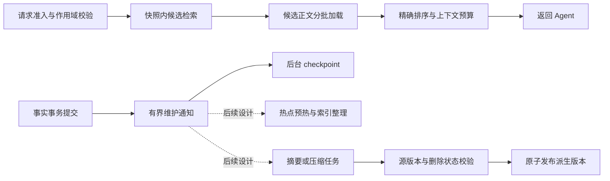

# 有界异步流水线与后台维护

流水线适合 MemWeft 的企业级扩展。它可以重叠不同请求的 I/O，把维护工作移出请求路径，并控制各阶段使用的资源。它不能消除一次请求内部的数据依赖，也不能自动降低总计算量。过量并发会增加排队和写入长尾。

当前 Python/Node 异步接口将同步 Rust 工作交给阻塞任务线程执行；它们尚未把一次 `context()` 拆成多个异步阶段。已实现的是**可选后台 WAL checkpoint、按阈值尝试回收及维护诊断**，不是完整查询、预加载和压缩流水线。

## 建议的两条路径



在线查询先做权限与池优先级解析，再检索候选、加载正文和组装上下文。跨请求可以重叠；将来的跨分片检索可受控并行。单次请求的加载依赖候选，输出依赖精确排序和预算，不能直接把几个函数同时执行就当成流水线。

后台路径处理 checkpoint、热点预热、索引整理，以及不影响当前回答的记忆摘要。普通无损压缩与模型摘要应分别计量：前者可能增加 CPU 开销，后者会改变信息内容，需要单独评估召回质量、可追溯性和采纳规则。

## 队列、版本与一致性

- 每阶段分别设置并发数和队列容量，限制总连接数、待加载字节和租户配额。队列满时合并可丢弃的预热通知，或对业务请求实施背压/超时，不能无限 `spawn`。
- 同一查询的候选和正文必须来自兼容快照。当前实现把资格检查、候选评分和正文加载留在一个 SQLite 读事务内；本轮没有拆开它。长期读事务会阻碍 WAL 回收，因此将来的分阶段方案需要快照期限或版本校验重试。
- 模型摘要等慢任务先读取带版本的输入，再在事务外计算，提交时检查源记录修订号和删除状态。源已更新、已遗忘或权限已变化的结果应拒绝发布。
- 持久业务任务需要任务 ID、幂等提交、重试上限与故障恢复。checkpoint 通知可以合并，事实写入和学习证据不能照此丢弃。
- 取消等待不一定停止已经运行的原生阻塞任务。完整流水线需要把取消和超时显式传给各阶段，不能仅以 Future 被取消来宣称工作已经停止。

这些约束同时适用于多租户总量上亿和单池上亿。逻辑池与物理分片的关系见[规模设计](preloading_and_scale.md)。

## 已实现：可选后台 checkpoint

SQLite 默认在达到 WAL 页数阈值后由提交线程执行自动 checkpoint，部分提交因而更慢；官方说明也给出把 checkpoint 放在独立线程或进程的方式。[SQLite WAL 性能说明](https://www.sqlite.org/wal.html#performance_considerations)

本轮跟踪隔离测试进程的系统调用，确认写入长尾中存在显著文件同步等待。提供以下可选配置，默认仍使用原来的 SQLite 自动 checkpoint：

```python
from memweft import Memory

memory = Memory(
    "data/memweft.db",
    sqlite_options={
        "background_checkpoint_ms": 1000,
        "wal_reclaim_threshold_bytes": 16 * 1024 * 1024,
    },
)
print(memory.storage_status())
```

```typescript
const memory = await Memory.open({
  path: "data/memweft.db",
  sqliteOptions: {
    backgroundCheckpointMs: 1000,
    walReclaimThresholdBytes: 16 * 1024 * 1024,
  },
});
console.log(await memory.storageStatus());
```

```rust
let memory = memweft::Memory::open_with_options(
    "data/memweft.db",
    memweft::SqliteOptions {
        background_checkpoint_ms: Some(1000),
        wal_reclaim_threshold_bytes: Some(16 * 1024 * 1024),
    },
)?;
```

配置仅适用于文件 SQLite，间隔范围为 100–60,000 ms。回收阈值可选，范围为 64 KiB–1 TiB，必须同时开启后台维护；不设置阈值就只做 PASSIVE。Python `AsyncMemory` 同样支持该配置及 `await memory.storage_status()`。它属于存储实例配置，不属于 Agent 的共享池/独立池绑定。

实现行为：

1. 每个启用的 store 保留一个独立连接和工作线程，但同一数据库只有取得维护文件锁的实例执行 checkpoint。其他实例按自己的维护间隔尝试接管，不执行 checkpoint。负责人通过同一连接的 `PRAGMA data_version` 检测其他连接/进程的提交，即使应用只通过它读取，也不会漏掉别的实例写入。[SQLite data_version](https://www.sqlite.org/pragma.html#pragma_data_version)
2. 写操作仍同步完成原事务后返回。只把维护通知送入容量为 1 的队列；重复通知可以合并，不缓存或合并事实写入。
3. 该实例池连接关闭自动 checkpoint，保持 `synchronous=NORMAL` 和 WAL；后台失败会记录错误，后续连接借出恢复自动 checkpoint。关闭实例时停止并等待工作线程；只有负责人尝试最后一次 PASSIVE，不在关闭时绕过退避去 TRUNCATE。内核在锁持有者关闭或进程退出时释放文件锁，待命实例随后可接管。
4. 若配置了阈值，PASSIVE 后检查 WAL 文件长度。若 PASSIVE 尚未复制完可见帧或无法取得有效进度，本周期跳过 TRUNCATE；否则达到阈值且重试时间已到时，通过 SQLite 尝试 TRUNCATE。维护连接的 `busy_timeout` 为 0，遇到读者或锁冲突就延后，不驱逐读者、不直接删除 WAL。
5. TRUNCATE 繁忙后按 5、10、20、30 秒退避，后续最多每 30 秒重试一次；成功后冷却 30 秒。实际尝试还需等到维护周期并满足条件，所以间隔可能更长。PASSIVE 仍按原周期推进，繁忙或超阈值的工作保留待处理标记，即使没有后续写入也继续检查。这些是当前内部策略，未增加新的公开配置项。
6. 零 busy timeout 仅表示不额外等待锁；checkpoint 仍有 I/O、同步和持锁开销，可能影响写入尾延迟。CAS、共享池修订号和遗忘语义不变。[SQLite checkpoint 模式](https://www.sqlite.org/c3ref/wal_checkpoint_v2.html)

协调锁位于规范化数据库路径旁的 `<database>.memweft-maintenance`。它是空的持久侧文件，使用 Rust 标准库非阻塞文件锁，不依赖租约 TTL，也不写入业务数据库。[Rust 文件锁说明](https://doc.rust-lang.org/std/fs/struct.File.html#method.try_lock) 符号链接路径会归一；不要在任何实例仍打开数据库时删除或替换侧文件，否则可能形成两个锁域。全部实例关闭后可以清理。该机制要求支持相应文件锁的本地文件系统和侧文件创建权限；不提供网络文件系统或分布式节点协调保证。原生构建最低 Rust 版本为 1.89。

同一文件的后台实例必须使用一致配置，实际维护采用当前负责人的参数；当前不会集中校验或合并不同实例的配置。所有参与后台维护的进程应升级到本版。默认自动 checkpoint 的实例、旧版实例及外部 SQLite 程序不参加这个协调域，仍可能执行自己的维护。每实例仍有工作线程，当前统一的是维护执行权，不是把所有连接和线程合成一个服务。

后台模式要求 SQLite 能返回有效的 UTF-8 数据库文件名；路径无法识别时明确拒绝启动，不将真实文件误判成无文件连接而跳过协调锁。默认自动 checkpoint 的路径处理保持不变。

队列上限只限制通知数量；回收阈值同样是**软阈值，不是 WAL 文件大小的硬上限**。长时间持有读快照、持续写入或慢磁盘都可能使 WAL 超过阈值。验收必须同时观察延迟、实际写入完成率和 WAL 空间，不能仅看前台返回得更快。

`storage_status()`（Node：`storageStatus()`）报告实际 SQLite 版本、后台/自动/故障回退模式，以及每实例的 PASSIVE 次数、回收尝试与成功次数、繁忙次数、最新页数、WAL 字节数、维护耗时、错误和采样时刻。页数和字节数来自最近一次维护，不是实时读数；没有可用页数时返回 null。峰值是维护采样的峰值，可能漏过两次采样之间的变化。多个实例的计数不会自动合并为数据库全局统计；状态查询也不会触发 checkpoint。

新增 `checkpoint.coordination=database_file_lock` 与退避/冷却常量；`progress.coordinator_role` 为 waiting、leader 或 follower（内部无文件测试连接为 standalone）。`leadership_acquisitions`、`coordination_waits`、`reader_deferred_runs`、`backoff_deferred_runs`、`reclaim_busy_streak`、`next_reclaim_after_ms` 可区分执行、待命、进度不足和退避。剩余等待毫秒数也是维护时采样，不是实时倒计时。只读调用者也可能担任负责人，因此监控需覆盖所有实例；待命实例维护计数为零不意味着全库没有维护。负责人变化后计数不会迁移，异常时以顶层 mode/error 判断工作线程状态。

内置 SQLite 已从 3.45.0 升级为官方修复版 3.51.3，处理并发写入与 checkpoint 的 WAL-reset race。源码、校验值和兼容范围见 [vendored 补丁说明](../vendor/libsqlite3-sys/MEMWEFT-PATCH.md)。此前短测的完整性通过不能证明不存在这一罕见问题。[官方缺陷说明](https://www.sqlite.org/wal.html#walresetbug)、[3.51.3 发布说明](https://www.sqlite.org/releaselog/3_51_3.html)

`NORMAL` 模式下提交后的跨连接可见性与断电持久化不是一回事。后台间隔会改变同步时机；本轮进程崩溃测试不能证明断电不丢失最近提交，也不能把这个选项当作 `FULL` 持久化模式。原先同样使用 `NORMAL`，默认配置未改变。

## 下一步如何逐步拆分

先验证后台维护的收益与代价，再做带内存预算的热点预热队列；在线侧优先保留短事务、改善慢查询算法。等单机阶段耗时和资源占比明确后，再引入受限并行的候选正文加载与分片查询。模型压缩作为带来源版本的独立任务推进，结果发布沿用学习采纳与遗忘约束。

各阶段需要记录排队时间、执行时间、吞吐、p95/p99、内存/字节预算、取消数、重试数和数据新鲜度。完整流水线、预加载和分布式调度尚未实现。先前短测见[流水线对照](../evals/reports/2026-09-22-pipeline-and-query.md)，后续长快照、WAL 回收与 Agent 验证见[跟进报告](../evals/reports/2026-09-22-wal-and-agent.md)。

同库协调、崩溃接管和回收退避的最新对照见[维护协调报告](../evals/reports/2026-09-22-wal-coordination.md)。
