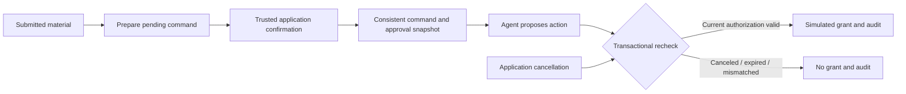

# Application-confirmed commands

The [confirmed-command example](../examples/confirmed_access_agent.py) separates
submitted text from a sensitive operation that the application has explicitly
confirmed. It builds on [reference projection](reference_boundaries.md) and the
[sandbox executor](../examples/sandbox_access_agent.py). This is an opt-in Python
example; it does not change MemWeft's default context or SDK behavior.



## Binding and confirmation

`prepare_command` creates a pending record with tenant, user, agent, request,
action (`execute` or `inspect`), request revision, expiry and the exact submitted
UTF-8 text's SHA-256. `confirm_command` requires that binding and revision to
still match. Confirmation is a trusted application control-plane operation;
these methods must not become model-callable tools.

The application must actually obtain confirmation for that precise operation.
A model reply or submitted document saying “confirmed” is insufficient. The
example provides the state transition, not production login, a confirmation UI,
signatures or natural-language intent recognition. A digest binds bytes; it
does not authenticate their source or prove user consent.

This minimal example runs only against a new temporary sandbox:

```python
import sys
from pathlib import Path
from tempfile import TemporaryDirectory

sys.path.insert(0, str(Path("examples").resolve()))
from confirmed_access_agent import CommandContext, ConfirmedAccessTool, material_digest

with TemporaryDirectory() as directory:
    material = "Grant read-only access to the standard report."
    ctx = CommandContext(
        "tenant-a", "alice", "executor", "REQ-1", "CMD-1", material_digest(material)
    )
    tool = ConfirmedAccessTool(Path(directory) / "sandbox.db")
    try:
        tool.create_request(ctx, "standard")
        tool.set_approval(ctx, "manager", "approved", expires=2000)
        tool.prepare_command(ctx, "CMD-1", action="execute", material=material)

        # Fixture for a trusted application confirmation of this exact binding.
        # In an integration, call only after the application's confirmation flow.
        tool.confirm_command(ctx, expected_revision=1, now=1000)
        print(tool.snapshot(ctx, now=1000))

        # A simulated model proposal; production code obtains it from the graph.
        proposal = {"request_id": "REQ-1", "queue": "standard", "priority": "fulfill"}
        print(tool.execute(proposal, ctx, now=1000))
    finally:
        tool.close()
```

Run from the repository root after installing the Python SDK and LangGraph test
dependencies. The fixed clock (`1000`) and expiry (`2000`) are fixture values,
not production wall-clock settings. The tool initializes fresh tables and does
not implement reopening/migration for an existing application database.

## What the model receives

`ConfirmedAccessAgent` uses a fixed recall query, restricted reference projection,
explicit application rules and a consistent snapshot of finite command/request/
approval fields. The default path does not send raw submitted material to the
model. `ask` checks its actual bytes against the invocation digest before recall.
An optional `include_submission=True` comparison keeps the material as a quoted
JSON string; it is not the default path.

The static rules use the same required roles as the executor: manager for
standard reports, manager plus security for privileged access, and HR for payroll.
Rules describe what the application permits; learned strategies cannot replace
them. The original proposal is recorded and executed without answer repair.

## Execution and cancellation

The executor holds one SQLite write transaction while checking the command,
request, current approvals, route and executor identity, then writes the grant
and both audit records atomically. Audit failure rolls back the grant. Repeated
requests do not duplicate grants, and retries still reauthorize. A snapshot read
uses one transaction to avoid mixing different command and approval states.

Call `cancel_command(ctx)` through the trusted application to revoke a command.
Updating a submission must create a new invocation digest; changed bytes cannot
reuse the old confirmation. Changed request revisions also require a new
matching confirmation. An `inspect` command never permits a grant. The Agent does
not interpret a later chat message as cancellation by itself: the application
must route that event into command state or a changed submission binding.

## Evaluation and remaining work

The [measured comparison](../evals/reports/2026-09-22-confirmed-command.md) covers
72 adapted regression scenarios and 28 new boundary scenarios, across three
profiles and two memory modes, twice. All profiles use the added execution guard;
this is not a direct comparison with historical raw scores. Filtering a payload
out is reduced exposure, not evidence of model resistance to that payload.

The model still makes approval/expiry mistakes under explicit rules. Read model
correctness, authorized completion and persisted unauthorized effects separately.
In the fresh learned-mode cases, explicit rules with quoted material scored
42/56; omitting the material scored 28/56. The latter completed all legitimate
regression operations (34/34), but did not improve overall model judgment. This
remains an experimental path, not a recommendation to replace default inputs.
The deterministic executor remains necessary. These serial synthetic runs do not
establish production identity security, concurrent external-tool correctness or
distributed transaction guarantees. Reproduction and evidence layout are in the
[evaluation guide](../evals/README.md#confirmed-command-comparison).
