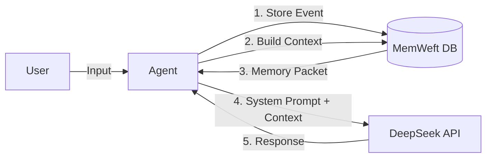

# MemWeft + DeepSeek Integration Guide

This guide demonstrates how to build a stateful AI Agent using **MemWeft** as the long-term memory backend and **DeepSeek-V3** (via OpenAI-compatible API) as the reasoning engine.

These examples also serve to verify the recent **Rust Core Optimizations** (Concurrency Fix, Query Pushdown, and O(N) Trimming).

## Prerequisites

```bash
# 1. Install OpenAI SDK (DeepSeek uses the same format)
pip install openai

# 2. Ensure MemWeft is installed (run from python directory)
cd python && maturin develop
```

## Architecture



---

## Example 1: The Cognitive Loop (`deepseek_loop.py`)

**Concept**: An agent that remembers user preferences across sessions.
**Optimization Verified**: **SQLite Concurrency**. The script initializes the DB. If you run multiple instances of this script, they will not crash with `database is locked` due to the new specialized startup logic in Rust.

### How it works:
1.  **Ingest**: Saves user chat logs to Short-term Memory.
2.  **Consolidate**: Simulates extracting a "Fact" (e.g., "User likes coffee") into Long-term Memory.
3.  **Recall**: Uses `build_memory_packet` to retrieve relevant history.
4.  **Generate**: Feeds the structured memory into DeepSeek.

---

## Example 2: Budget & Performance (`deepseek_budget.py`)

**Concept**: Simulating a heavy-load scenario to test token budgeting.
**Optimization Verified**: 
1.  **Query Pushdown**: We insert 200 facts. The `build_memory_packet` will only fetch the Top-K from SQLite (using `LIMIT`), avoiding full table scans.
2.  **O(N) Trimming**: When forcing a tiny budget (e.g., 200 tokens), the algorithm trims excess data without re-serializing the entire list repeatedly, ensuring speed even with massive context.

---

## Example 3: Task Planning (`deepseek_planning.py`)

**Concept**: Managing dynamic agent state (Goals, Plans, Decisions) separate from static facts.
**Optimization Verified**: **Zero-Copy State**. The `WorkingState` is passed by value in Rust, reducing memory overhead when handling complex plans.

## Running the Examples

Please edit the files to insert your API Key: `api_key="your_deepseek_api_key"`.

```bash
# Run the chat loop
python examples/deepseek_loop.py

# Run the performance verification
python examples/deepseek_budget.py

# Run the planning demo
python examples/deepseek_planning.py
```
