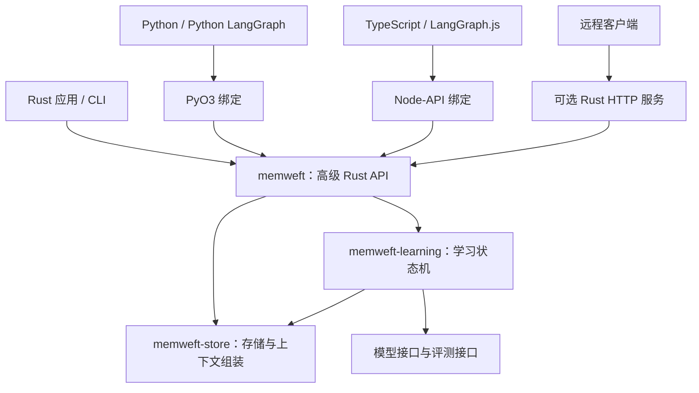

# MemWeft：Rust 学习核心与跨语言接入设计

状态：分阶段实现中。已实现高级 Rust API、Python/Node.js 绑定、两种 LangGraph 的节点辅助类和 BaseStore、可持久化的候选评测/采用/回退，以及 CLI。以下架构保留后续规划；以根 README 中的可运行接口和限制为准。

当前差异：新 API 首先支持 SQLite；模型提案器和评测器由应用提供；反思策略可以版本化并传给下一轮 Rust Proposer，但尚无内置模型客户端与自动多轮调度。HTTP 服务、完整 checkpoint 和公开包注册发布尚未完成。CI 已配置跨平台构建，本地验证不能替代 CI 平台验证。

## 目标与支持范围

MemWeft 提供持久记忆、上下文组装和可验证的策略改进。记忆与学习业务逻辑统一使用 Rust 实现，Python 和 TypeScript 只负责语言绑定与框架适配。

本次确认的目标包括：

- Rust 应用直接使用。
- Python 应用及 Python LangGraph。
- Node.js 上的 TypeScript 应用及 LangGraph.js。
- 可选 HTTP 服务，为独立进程、远程应用和不能加载原生扩展的运行环境提供接口。

默认本地接入不需要额外启动服务，也不要求最终用户安装 Rust 工具链。模型调用由使用者配置；纯 Rust 核心可以调用远程模型，不等于模型推理也必须在本机运行。

## 架构



建议新增一个 `memweft` 门面 crate，提供用户绑定、会话绑定、简洁写入和上下文输出。保留现有底层接口作为高级入口。

| 模块 | 责任 |
| --- | --- |
| `memweft-types` | 领域类型、可序列化请求和结果、版本化数据契约 |
| `memweft-store` | 数据持久化、查询、上下文组装及事务支持 |
| `memweft-learning`（新增） | 候选生成、评测管理、采用规则、策略版本和回退 |
| `memweft`（新增） | 易用的 Rust 入口，共享默认值、校验和错误模型 |
| `memweft-ffi` | 现有 PyO3 绑定，逐步调用高级 Rust API |
| `memweft-node`（新增） | Node-API 绑定，提供 Promise 和 TypeScript 类型 |
| `memweft-cli`（新增） | 初始化、检查记忆、查看学习结果、比较及恢复版本 |
| `memweft-server`（后续） | 将同一套 Rust API 暴露为版本化 HTTP 接口 |

Python、TypeScript 和 HTTP 层不各自实现排序、裁剪、采用策略或学习循环。跨语言接口允许命名风格不同，但默认值、状态转移和错误含义必须相同。

当前同步数据库操作通过有并发上限的阻塞任务执行，模型请求异步执行。取消请求不能被解释为已终止一个正在运行的阻塞数据库操作；事务结果和学习任务状态必须可查询。

## 易用接口

以下代码仅展示目标 API。语言绑定的公共签名以实现阶段的契约测试为准。

Python：

```python
from memweft import Memory

memory = Memory("./memory.db")
alice = memory.user("alice")
alice.remember("喜欢简短、直接的回答", key="reply_style")

chat = alice.session("chat-001")
chat.add_message("user", "帮我解释 Rust 的所有权")
context = chat.context(max_tokens=1000)
print(context.text)
```

TypeScript：

```typescript
import { Memory } from "memweft";

const memory = await Memory.open({ path: "./memory.db" });
const alice = memory.user("alice");
await alice.remember("喜欢简短、直接的回答", { key: "reply_style" });

const chat = alice.session("chat-001");
await chat.addMessage("user", "帮我解释 Rust 的所有权");
const context = await chat.context({ maxTokens: 1000 });
console.log(context.text);
```

包名只是设计占位，发布前需要核验注册权限与平台产物。Node.js 本地扩展不能直接作为浏览器或 Edge 环境的存储实现；这些环境通过应用后端连接 HTTP 服务。

公共语义：

- 用户身份由调用方明确传入；tenant、agent 提供稳定默认值并支持显式设置。
- session 标识会话，run 标识单次执行。恢复同一会话能够读取其既有消息，不因新建 run 丢失会话连续性。
- 同一作用域下相同记忆 key 表示更新。事件默认生成唯一 ID，重试和框架恢复支持调用方提供稳定幂等键。
- 保存消息不自动调用模型。提取长期记忆和运行学习都显式触发。
- 高级聊天接口默认包含近期对话；上下文同时提供文本、结构化数据、来源和预算报告。
- 记忆文本作为引用资料呈现，模型生成的策略有单独的来源和适用范围。
- 提供检查、更新、删除和遗忘入口；反馈、策略和记忆都遵循明确的作用域。
- 删除记忆需要定义派生策略的处理规则，避免被遗忘的内容仍通过策略继续使用。
- 当前 token 预算只是估算且存在超限返回路径。新接口上线前须明确计量方式、完整计量范围以及不可裁剪内容超限时的行为，不沿用未经验证的严格上限承诺。

## LangGraph：两种语言采用相同接入语义

LangGraph 将线程内图执行状态的 checkpoint 与跨线程长期数据的 store 分开。MemWeft 先提供记忆与学习接入，和应用已有 checkpointer 配合使用。[Python 持久化文档](https://docs.langchain.com/oss/python/langgraph/persistence)、[JavaScript 持久化文档](https://docs.langchain.com/oss/javascript/langgraph/persistence)。

### 首轮接入：图节点调用

Python 和 JavaScript 都提供可复制的完整图示例：

1. 节点从应用提供的用户身份和图配置读取 scope。
2. `thread_id` 映射为 session；run 使用单次图执行的稳定标识。
3. 模型节点执行前，读取长期记忆与已生效策略，构建上下文。
4. 任务结束后记录结果和反馈；使用稳定幂等键处理重试、恢复及重复通知。
5. 学习作为单独的显式步骤执行，不在每个节点后隐式启动模型调用。

一段历史消息只由一个入口负责加入最终上下文。LangGraph 已管理消息窗口时，MemWeft 可以只返回长期记忆与策略，避免重复注入同一段对话。

当前 `MemWeftCheckpointer` 只是工作状态的 `get/put` 包装，不符合 LangGraph 的完整 checkpoint 契约。实现时应对它弃用或改名，并修正文档，不能继续将其描述为可直接传给 `compile` 的检查点实现。

### 第二步：正式 Store 适配器

分别适配受支持版本的 Python 和 JavaScript Store 协议，实现协议要求的命名空间、键值读写、删除、搜索、过滤、分页、批处理和异步行为。

为通用 JSON 文档设计独立存储结构，不把任意 LangGraph state 强行转换成 Fact。命名空间必须在租户、用户、agent 的隔离边界内映射，不能仅靠 `thread_id` 识别用户。

关键词检索与向量语义检索分别声明能力。未配置或未实现的语义查询需要明确报错，不将按时间排列的结果伪装成语义搜索。

### 后续：可选 checkpoint 实现

如果需要由 MemWeft 同时承接图执行持久化，再实现完整 checkpoint 协议，包括父子关系、元数据、通道版本、pending writes、历史查询、序列化及恢复语义，并用实际图中断/恢复测试验证。

首轮 LangGraph 支持以节点接入为准，不依赖该后续能力，也不承诺 Python 与 JavaScript 的内部 checkpoint 格式可以互换。

## Rust 学习引擎

第一阶段改进任务策略；后续将反思模板、候选生成方法等学习策略也纳入版本与评测，从而支持改进机制自身的迭代。

核心接口：

- `Proposer`：从经历和反馈生成候选策略及适用范围。
- `Evaluator`：对候选和基线进行评测，提交可追溯的观测结果。
- `AcceptancePolicy`：按照应用定义的稳定标准判断是否采用。

学习状态建议为：`pending → proposing → evaluating → accepted/rejected/failed/cancelled`。超时、崩溃后可以查询并恢复，不能重复采用同一候选。

每次学习记录：任务和作用域、幂等键、基线版本、候选内容、父版本、生成器版本、评测器及评测集版本、逐例结果、质量与成本指标、采用原因。

采用新策略时，以事务和基线版本检查更新生效指针。并发学习遇到基线变化时重新评估或报告冲突。回退切换生效指针并记录操作，不删除历史。

评测基准与提案案例分开；同时衡量质量、已有能力退化、延迟和调用成本。无足够证据时保留基线。模型自评和置信度不能单独决定采用。

现有 Insight 可用于保存候选描述，但其 run 级作用域、追加接口和状态字段不足以实现跨 run 的学习版本管理；需要独立的学习记录与策略版本存储。未验证候选与已生效策略分别查询和注入。

### Python / JavaScript 应用如何参与评测

纯 Rust 核心不意味着 Rust 必须重写应用的图执行逻辑。应用仍执行自己的 LangGraph 或业务任务，Rust 决定学习状态及采用规则。

提供两类评测接入：

- Rust 内置或使用者实现的评测器，完整在 Rust 内运行。
- 外部评测任务：核心创建带有基线、候选、数据集版本和 job ID 的任务；宿主应用运行图并提交结果。核心校验结果归属、幂等性和完整性后再决定是否采用。

外部评测接口不是任意设置 `validated=true` 的入口。学习轮次、候选数量和模型调用预算由核心执行；最终验收规则不由候选策略修改。

## 安装与发布

- Python：发布预编译 wheel，并测试从 wheel 安装后的原生模块导入。
- Node.js：使用 napi-rs 构建原生扩展及 TypeScript 声明，发布平台二进制与加载器。该工具支持按平台分发扩展。[napi-rs 官方指南](https://napi.rs/docs/introduction/getting-started)。
- 纯 Rust：通过库 API 和可下载 CLI 使用，核心 crate 不依赖 PyO3 或 Node-API。
- HTTP 服务：后续复用同一 API；增加协议版本、认证和服务端作用域绑定，浏览器请求通过应用的认证边界接入。

安装后的能力以实际发布和测试矩阵为准。先验证 Linux x64、macOS arm64 和 Windows x64，再逐步扩大；Python、Node.js 与 LangGraph 的具体版本在实现阶段锁定并公开，不依赖未测试的最新版兼容假设。

## 交付顺序与验收

| 阶段 | 交付 | 必须验证的结果 |
| --- | --- | --- |
| 1 | 高级 Rust API、Python 与 Node.js 基础绑定 | 两种语言均能保存偏好、重启后取回、更新和遗忘；默认范围与错误一致 |
| 2 | Python LangGraph 与 LangGraph.js 节点接入示例 | 两个实际图均能跨会话使用记忆；重试不重复写入；沿用应用 checkpointer 正常恢复 |
| 3 | Rust 学习闭环及两种语言的反馈入口 | 基线/候选对比、拒绝退化、采用版本、恢复失败任务和回退均可测试 |
| 4 | 正式 Store 适配器及预编译分发 | 框架协议契约通过；目标平台无 Rust 工具链也能安装使用 |
| 5 | 学习机制自身的版本优化 | 在独立任务集上验证改进生成器的效果，保留固定验收标准和回退路径 |

HTTP 服务和完整 checkpoint 作为后续扩展，不作为本地记忆接入的前置条件。

契约测试使用一套固定数据分别调用 Rust、Python 和 TypeScript，比较结果、作用域隔离、状态转移与错误。原生绑定必须执行真实数据库读写，不能只用 mock 证明接入成功。

第一组验收示例不依赖外部模型 API Key；学习状态机使用确定性的提案器和评测器验证，另设显式开启的真实模型集成测试。预算裁剪、删除传播、重复反馈、并发采用冲突和跨用户隔离均需要行为测试。

## 当前实现与验证入口

实际实现位于 `crates/memweft`、`crates/memweft-learning`、`crates/memweft-node`、`python/src/memweft/api.py` 和 `typescript/src`。`tests/contract.json` 由 Rust、Python、TypeScript 共同回放；两种框架使用真实 LangGraph 图进行集成测试。

当前依赖已补齐并能构建原生扩展。后续仍需实现内置模型调用、自动多轮调度、跨平台发布验证、HTTP 服务和可选完整 checkpoint。应用提交的评测结果来自可信调用方，不能将结构校验理解为对分数真实性的验证。
